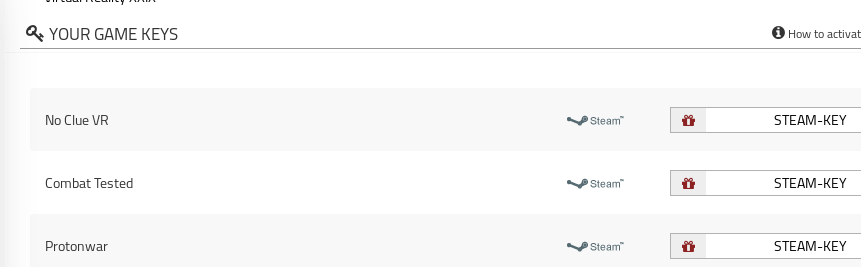

# IndieGala Create Giveaway Helper
Tampermonkey script that let the user create a IndieGala giveaway with less effort.

This script only applies to gift pages for now because is the only thing I had to try, maybe in the future it will be available to store purchases as well.

## How to install

1. You need to install Tampermonkey in [Firefox](https://addons.mozilla.org/es/firefox/addon/tampermonkey/) or [Chrome](https://chrome.google.com/webstore/detail/tampermonkey/dhdgffkkebhmkfjojejmpbldmpobfkfo)
2. Go to the [raw version of the script](https://github.com/MrMarble/IndieGalaCreateGiveawayHelper/raw/master/IndieGalaCreateGiveawayHelper.user.js) and it should prompt the installation window directly.

## Usage

When you receive a  gift on Indiegala, the url should look like this:

 `https://www.indiegala.com/gift?gift_id=a_bunch_of_random_characteres`

When you click the steam button, the game key will appear and next to it a red gift icon, when you click that icon a new window will pop-up (maybe you need to give permission first time) that new window will have all the information filled for the giveaway of that game, ready for you to press 'CREATE GIVEAWAY' button so you can still change things if you want.

